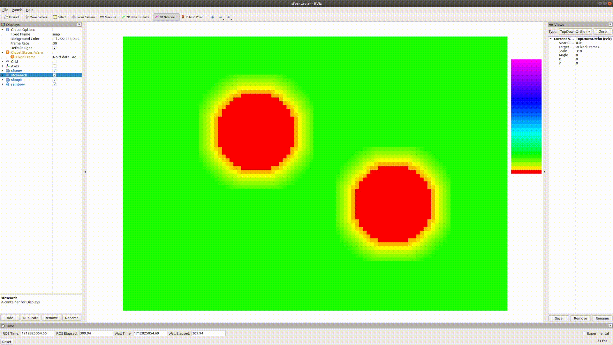

# POI-planner
A More Flexible And Safer Sequential Motion Planning Leveraging Heuristic Maps. 
We proposed a new POIs model which builds a mechanism for information exchange that leverages the locality of motion planning to tightly couple planning and mapping.

<table width="100%">
  <tr>
    <td width="50%" align="center">
      
    </td>
    <td width="50%" align="center">
      
    </td>
  </tr>
</table>

<strong>Figure 1. System Architecture (left) and Workflow Demo (right)</strong>

We will release details soon...
